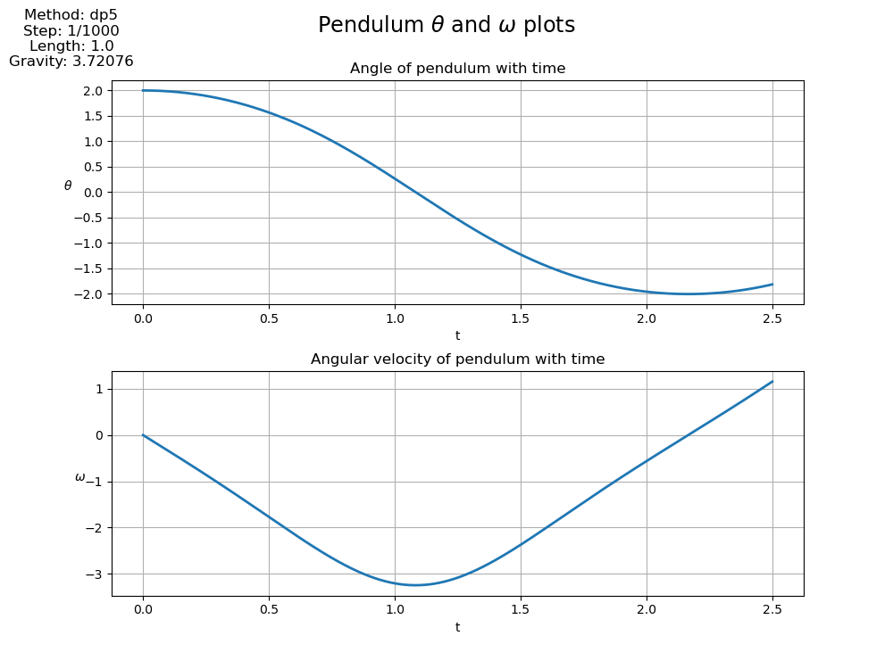

# Pendulum

## Description
This is a simple simulation of physical pendulum behaviour. It's a project for the 2024 ETU Numerical Modeling of Dynamic Systems course.

## Table of Contents
- [Installation](#installation)
- [Usage](#usage)

## Installation
1. Clone the repository: `git clone https://github.com/Nekson228/Pendulum.git`
2. Install the required packages: `pip install -r requirements.txt`

## Usage

This project is a command-line interface (CLI) application. Here are the steps to run the simulation:

1. Run the main script with the following command:
    ```
    python main.py
    ```
    This will run the simulation with the parameters specified in the `data/constants.json` file.

2. If you want to override the parameters in the `data/constants.json` file, you can do so by providing them as command-line arguments. Here are the available options:
    - `-f`, `--file`: Path for output file (saved in csv format).
    - `-m`, `--method`: Runge-Kutta method name.
    - `-s`, `--step`: Step size in seconds (as a fraction).
    - `-t`, `--time`: Simulation time in seconds.
    - `-l`, `--length`: Pendulum length in meters.
    - `-g`, `--gravity`: Gravity acceleration in m/s^2.
    - `-a`, `--theta`: Initial angle in radians.
    - `-v`, `--omega`: Initial angular velocity in rad/s.
    - `-h`, `--help`: Display help message.
    - `--save`: Save the animation as a gif file and the plot as a png file.

    For example, to run the simulation with a pendulum angle of 2 rad and length of 1.0 meter at mars gravity for 2 seconds, you can use the following command:
    ```
    python main.py -l 1 -t 2 -g 3.72076 -a 2 --save
    ```
    This will run the simulation with the specified parameters and save the animation as a gif file and the plot as a png file. This is the result of the simulation: <br>  <br> 


3. After the simulation is finished, data will be saved in a csv file specified by the `-f` or `--file` argument (The default file is `pendulum.csv`.). <br> Program will also display pendulum animation and plot of angle and angular velocity as a function of time, based on the data from the simulation. 
